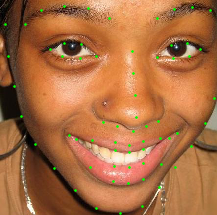

# Smile and open mouth detection using facial landmarks

In this repository you can find a trained model for detecting smiles and open mouth on images. This model uses [dlib](http://dlib.net) face and facial landmarks detector.  

## Data
Train data consists of 865 images from [Helen dataset](http://www.ifp.illinois.edu/~vuongle2/helen/) and other sources. Also there additional 40 images from Helen dataset for manual testing.

## Preparing the data
Faces and landmarks were extracted from source train images using dlib and hand-labeled for smile and open mouth using interactive widgets in Jupyter Notebook. This is performed in [preprocess_and_label.ipynb](preprocess_and_label.ipynb) notebook. 

## Model selection and training
A simple Feed-Forward model is [trained](train_and_evaluate.ipynb) on 2278 pairwise distances between facial landmarks points. The distances are precomputed for the train set in [distances.npy](data/features/distances.npy) file. Model layers sizes are:    
`2278 -> 1000 -> 700 -> 500 -> 500 -> 4`.  
The full architecture is shown on the [figure](models/ff_1000_700_500_500.png).

## Results
After 100 epochs of training using Adam optimizer with learning rate 0.0001 an accuracy of ~ 0.85 is achieved on test data. Manual testing on extra images shows reasonable results on new images.
